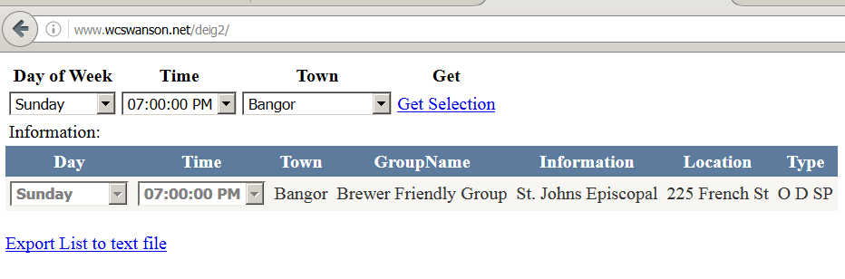

# Data Driven Meeting List  

##Purpose:
This Meeting List Project takes the meeting list from a large group from a html page and moves the data into a database.
The data source can be filtered by day, time, and location. Also the entire database can be downloaded into a text file
for use off line. In another repository, the inserts, updates, and deletes will be posted. A wiki for more information on this project will be posted. Today's date: 10/10/2016

##This is a simple page for displaying the Meeting List.
This project was written after finding that the updates would not work by going through an iframe. So it was used instead just to display the meeting list. Just the default.aspx file group and the web.config files are all that are needed to display the data. Just put these files into a folder on the IIS server, convert the folder in IIS to an application and then browse to the folder to see the results of the meeting list.

##Tools used:
ASP.NET 4.5
Visual Studio 2012
SQL Server 2012
C#

##Instructions:
1. Download files
2. Create the database
3. Modify the connection strings
4. Run
